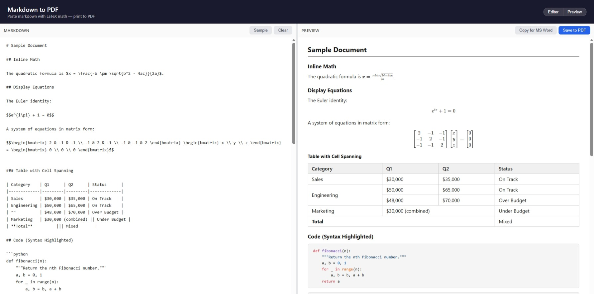

# Markdown to PDF

A single-file, client-side Markdown-to-PDF converter. No build step, no server, no dependencies to install — just open `index.html` in a browser.

**[Live Demo](https://diwakar-s-maurya.github.io/markdown-to-pdf/)**



## Features

- **Live preview** — side-by-side editor and rendered output, updated as you type
- **PDF export** — uses the browser's native Print dialog (`Ctrl+P` / `Cmd+P`) with clean A4 print styles
- **Copy for MS Word** — copies the rendered output to the clipboard with inline styles, ready to paste into MS Word or Google Docs
- **LaTeX math** — inline (`$...$`) and display (`$$...$$`) equations via KaTeX
- **Syntax highlighting** — fenced code blocks with language detection via highlight.js
- **Rich Markdown** — footnotes, task lists, definition lists, tables (with multiline/rowspan/colspan), subscript, superscript, abbreviations, emoji, `==highlights==`, `++insertions++`, ~~strikethrough~~, custom containers
- **Resizable panes** — drag the split handle to resize; double-click to reset
- **Toggle panes** — hide the editor or preview to use the full width; split position is restored when toggling back
- **Customizable print settings** — tweak font, margins, and page size from the browser console

## Usage

1. Open `index.html` in any modern browser
2. Write or paste Markdown in the left pane
3. Click **Print to PDF** (or `Ctrl+P`) to export

No internet connection is needed after the page loads (all CDN assets are cached by the browser).

## Print Customization

Open the browser console and modify `printSettings` before printing:

```js
printSettings.fontSize   = '12pt'
printSettings.fontFamily = "'Arial', sans-serif"
printSettings.pageSize   = 'Letter'
printSettings.marginTop  = '1.5cm'
printPDF()
```

## Tech Stack

Everything lives in a single `index.html` file. Dependencies are loaded from CDN at runtime:

| Library | Version | Purpose |
|---------|---------|---------|
| [markdown-it](https://github.com/markdown-it/markdown-it) | 14.1.1 | Markdown parsing and rendering |
| [KaTeX](https://katex.org) | 0.16.28 | LaTeX math rendering |
| [highlight.js](https://highlightjs.org) | 11.11.1 | Syntax highlighting |
| [markdown-it-texmath](https://github.com/user/markdown-it-texmath) | 1.0.0 | Bridges markdown-it and KaTeX |

Plus markdown-it plugins for footnotes, task lists, definition lists, sub/superscript, abbreviations, emoji, containers, ins, mark, and multiline tables.

## License

MIT
